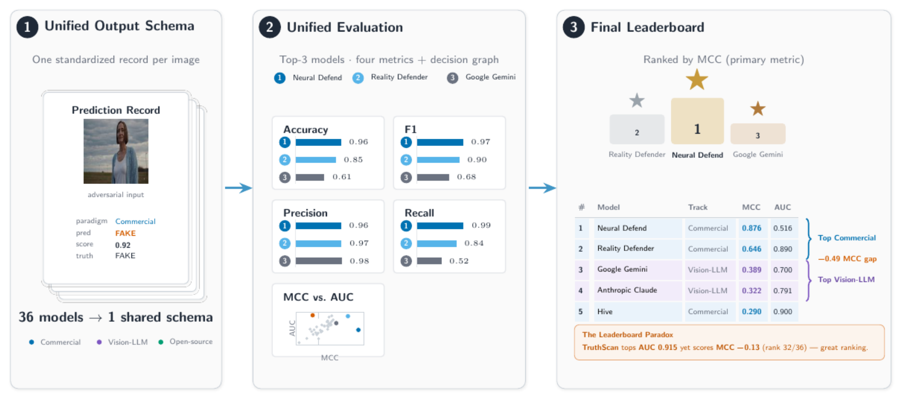

# VendorBench-100: A Unified Cross-Paradigm Benchmark for Deepfake Image Detection

VendorBench-100 evaluates 36 detectors across three paradigms — 5 commercial APIs, 7 zero-shot
vision LLMs, and 24 open-source detectors — on one shared adversarial image corpus under a single
output schema and a single metrics engine. Models are ranked by the Matthews Correlation Coefficient
(MCC), with ROC-AUC as a threshold-free tiebreak.

<p align="center">
  
</p>

## Overview

Commercial detection APIs, general-purpose vision LLMs, and open-source detectors are almost never
measured on common ground. VendorBench-100 places all three on one fixed, deliberately hard corpus,
normalizes every model's output into the same `(label, P(fake), success)` record, and scores them with
the same metrics. The headline finding is not a single winner but a consistent divergence between
ranking ability (ROC-AUC) and operating-point quality (MCC): strong class separation does not
guarantee a reliable decision at a model's shipped 0.5 threshold.

## Dataset

The image corpus is not distributed in this repository. It is hosted separately as a gated Hugging
Face dataset (access by request): https://huggingface.co/datasets/SharayuD/vendorbench-100

> **Status:** the Hugging Face repository is live and gated (access is granted after manual review of
> a short request form).

**Design.** A compact, hand-picked adversarial corpus (fake images + real negative controls) built
for difficulty rather than scale, spanning 8 edge-case failure families across 21 provenance source
groups, with a strict anti-leakage protocol (models are served neutral numeric filenames; the
descriptive `fake_<GROUP>_NNN` labels are post-hoc join keys only) and a per-image provenance registry.

The eight failure families: live / virtual face-swap smear · near-duplicate face-swap selfies ·
letterboxed text-to-video stills (Sora/Veo) · AI-avatar compositing seams (HeyGen) · fully synthetic
text-to-image · on-device AI photo-edits of real scenes · opaque / unknown provenance · compressed
research-dataset frames (DF40, FaceForensics++).

## Results

> **Note:** these figures reflect the initial evaluation run and may be revised; treat them as
> preliminary.

Ranked by MCC (primary), ROC-AUC (tiebreak); positive class = FAKE. Full 36-model leaderboard and
all figures: [`docs/RESULTS.md`](docs/RESULTS.md).

| Track | Models | Best MCC | Median MCC | Best ROC-AUC | Median ROC-AUC |
|---|---:|---|---:|---|---:|
| Commercial API | 5 | 0.876 (`neural_defend`) | 0.290 | 0.915 (`truthscan`) | 0.890 |
| Vision LLM | 7 | 0.389 (`gemini`) | 0.199 | 0.791 (`claude_opus48`) | 0.632 |
| Open-source | 24 | 0.289 (`ntire2026`) | 0.062 | 0.866 (`drct`) | 0.566 |

<p align="center">
  
</p>

**Key findings.** Best operating point: `neural_defend` (MCC 0.876). Best ranker: `truthscan`
(ROC-AUC 0.915, yet MCC −0.130 from a mis-calibrated default threshold). Best open-source ranker
`drct` (0.866) beats every vision LLM. Paradigm order by median MCC: Commercial > LLM > Open-source.

## Repository structure

```
benchmark_nd/
├── benchmark/            Core package: runner, metrics, shared schema, per-track adapters
│   ├── commercial_apis/  5 vendor HTTP clients
│   ├── llms/             7 vision-LLM adapters + shared verdict normalization
│   └── opensource_models/ 24 detector loaders (Tier A/B/C) + registry
├── scripts/             Track drivers + aggregation (run, import, export, compare)
│                        (dataset hosted separately — gated Hugging Face, link above)
├── results/             Aggregated summary.json + per-image.csv per track
├── images/              Publication figures (architecture + F01–F14)
├── docs/                RESULTS.md (full leaderboard + figures), MODELS.md, LLMS.md
├── requirements.txt     Commercial-API + reporting deps
└── requirements-research.txt  Open-source + LLM deps (torch, transformers)
```

## Setup

```bash
# Base env (commercial-API track + reporting)
python -m venv .venv && .venv/bin/pip install -r requirements.txt

# Research env (open-source + LLM tracks; needs a CUDA GPU)
python -m venv .venv-research && .venv-research/bin/pip install -r requirements-research.txt

cp config.env.example config.env   # then add commercial-API keys (gitignored)
```

## Usage

```bash
# Commercial APIs — call each vendor over Source/, then report
python -m benchmark.main run
python -m benchmark.main report

# Open-source detectors — download weights, run on GPU, report
.venv-research/bin/python scripts/download_models.py
.venv-research/bin/python scripts/run_research.py
.venv-research/bin/python scripts/report_research.py

# Vision LLMs — import pre-collected dumps and report
.venv-research/bin/python scripts/import_llms.py
.venv-research/bin/python scripts/report_llms.py

# Aggregate all tracks and build the cross-paradigm comparison
.venv-research/bin/python scripts/export_results.py
.venv-research/bin/python scripts/report_compare.py
```

## Data & artifacts

- **Dataset** — hosted separately as a gated Hugging Face dataset (see [Dataset](#dataset)).
- **Aggregated results** (`results/*/summary.json`, `per-image.csv`) and all figures are in this repo.
- **Per-image evidence logs** and **raw model outputs** are available on request.
- **Model weights** are not committed; they are fetched by `scripts/download_models.py`.

## Citation

```bibtex
@misc{deshmukh2026vendorbench100,
  author = {Deshmukh, Sharayu N. and Deshmukh, Nilesh K.},
  title  = {VendorBench-100: A Unified Cross-Paradigm Benchmark for Deepfake Image Detection},
  year   = {2026}
}
```

## License

Code is released under the [MIT License](LICENSE). The image corpus is provided for research and
benchmarking use only; third-party generator outputs and any images of external origin remain the
property of their respective owners.
