# VendorBench-100 — Results

Unified cross-paradigm benchmark: **36 models** (5 commercial APIs · 7 vision LLMs · 24 open-source detectors) scored on one fixed **100-image corpus (79 FAKE / 21 REAL)**. Positive class = **FAKE**. Ranked by **MCC** (primary) with **ROC-AUC** as the threshold-free tiebreak. Failed/abstained calls are excluded from rate metrics and surfaced via **Coverage**.

> All numbers are regenerated directly from `results/<track>-benchmark/summary.json`. Figures are in [`../images/`](../images/) and regenerable via the figure script.

## Table 1 — Unified leaderboard (all 36 models)

| # | Model | Track | MCC | ROC-AUC | Acc | F1 | Prec | Rec | Spec | Cov | TP | FP | TN | FN |
|---:|---|---|---:|---:|---:|---:|---:|---:|---:|---:|---:|---:|---:|---:|
| 1 | `neural_defend` | Commercial API | 0.876 | 0.516 | 0.960 | 0.975 | 0.963 | 0.987 | 0.857 | 0.99 | 77 | 3 | 18 | 1 |
| 2 | `reality_defender` | Commercial API | 0.646 | 0.890 | 0.850 | 0.898 | 0.971 | 0.835 | 0.905 | 1.00 | 66 | 2 | 19 | 13 |
| 3 | `gemini` | LLM | 0.389 | 0.700 | 0.610 | 0.678 | 0.976 | 0.519 | 0.952 | 1.00 | 41 | 1 | 20 | 38 |
| 4 | `claude_opus48` | LLM | 0.322 | 0.791 | 0.490 | 0.523 | 1.000 | 0.354 | 1.000 | 1.00 | 28 | 0 | 21 | 51 |
| 5 | `hive` | Commercial API | 0.290 | 0.900 | 0.450 | 0.466 | 1.000 | 0.304 | 1.000 | 1.00 | 24 | 0 | 21 | 55 |
| 6 | `ntire2026_deepfake` | Open-source | 0.289 | 0.750 | 0.600 | 0.682 | 0.915 | 0.544 | 0.809 | 1.00 | 43 | 4 | 17 | 36 |
| 7 | `dima806_ai_vs_real` | Open-source | 0.277 | 0.655 | 0.810 | 0.893 | 0.806 | 1.000 | 0.095 | 1.00 | 79 | 19 | 2 | 0 |
| 8 | `qwen` | LLM | 0.267 | 0.678 | 0.470 | 0.505 | 0.964 | 0.342 | 0.952 | 1.00 | 27 | 1 | 20 | 52 |
| 9 | `bombek1_siglip_dinov2` | Open-source | 0.259 | 0.649 | 0.570 | 0.650 | 0.909 | 0.506 | 0.809 | 1.00 | 40 | 4 | 17 | 39 |
| 10 | `sightengine` | Commercial API | 0.258 | 0.702 | 0.410 | 0.404 | 1.000 | 0.253 | 1.000 | 1.00 | 20 | 0 | 21 | 59 |
| 11 | `organika_sdxl` | Open-source | 0.233 | 0.677 | 0.510 | 0.574 | 0.917 | 0.418 | 0.857 | 1.00 | 33 | 3 | 18 | 46 |
| 12 | `drct` | Open-source | 0.230 | 0.866 | 0.470 | 0.514 | 0.933 | 0.354 | 0.905 | 1.00 | 28 | 2 | 19 | 51 |
| 13 | `aidfr_real_v2` | Open-source | 0.227 | 0.694 | 0.670 | 0.769 | 0.859 | 0.696 | 0.571 | 1.00 | 55 | 9 | 12 | 24 |
| 14 | `nahrawy_aiornot` | Open-source | 0.211 | 0.602 | 0.520 | 0.593 | 0.897 | 0.443 | 0.809 | 1.00 | 35 | 4 | 17 | 44 |
| 15 | `ummmaybe_vit` | Open-source | 0.201 | 0.761 | 0.510 | 0.581 | 0.895 | 0.430 | 0.809 | 1.00 | 34 | 4 | 17 | 45 |
| 16 | `llama4_maverick` | LLM | 0.199 | 0.533 | 0.340 | 0.283 | 1.000 | 0.165 | 1.000 | 1.00 | 13 | 0 | 21 | 66 |
| 17 | `nemotron_nano_vl` | LLM | 0.196 | 0.632 | 0.394 | 0.374 | 0.944 | 0.233 | 0.952 | 0.94 | 17 | 1 | 20 | 56 |
| 18 | `rine` | Open-source | 0.187 | 0.737 | 0.380 | 0.367 | 0.947 | 0.228 | 0.952 | 1.00 | 18 | 1 | 20 | 61 |
| 19 | `gpt_openai` | LLM | 0.135 | 0.622 | 0.370 | 0.364 | 0.900 | 0.228 | 0.905 | 1.00 | 18 | 2 | 19 | 61 |
| 20 | `commfor_vit384` | Open-source | 0.123 | 0.620 | 0.550 | 0.651 | 0.840 | 0.532 | 0.619 | 1.00 | 42 | 8 | 13 | 37 |
| 21 | `yaya_source` | Open-source | 0.075 | 0.482 | 0.730 | 0.836 | 0.802 | 0.873 | 0.191 | 1.00 | 69 | 17 | 4 | 10 |
| 22 | `ash_flux_vit` | Open-source | 0.072 | 0.650 | 0.500 | 0.597 | 0.822 | 0.468 | 0.619 | 1.00 | 37 | 8 | 13 | 42 |
| 23 | `king1oo1_deepguard` | Open-source | 0.053 | 0.459 | 0.510 | 0.614 | 0.812 | 0.494 | 0.571 | 1.00 | 39 | 9 | 12 | 40 |
| 24 | `haywoodsloan_deploy` | Open-source | 0.038 | 0.507 | 0.410 | 0.469 | 0.812 | 0.329 | 0.714 | 1.00 | 26 | 6 | 15 | 53 |
| 25 | `declip` | Open-source | 0.000 | 0.275 | 0.210 | 0.000 | 0.000 | 0.000 | 1.000 | 1.00 | 0 | 0 | 21 | 79 |
| 26 | `date3k2_vit` | Open-source | -0.010 | 0.432 | 0.340 | 0.353 | 0.783 | 0.228 | 0.762 | 1.00 | 18 | 5 | 16 | 61 |
| 27 | `c2p_clip` | Open-source | -0.037 | 0.385 | 0.370 | 0.422 | 0.767 | 0.291 | 0.667 | 1.00 | 23 | 7 | 14 | 56 |
| 28 | `gend_dinov3_l` | Open-source | -0.043 | 0.597 | 0.340 | 0.365 | 0.760 | 0.240 | 0.714 | 1.00 | 19 | 6 | 15 | 60 |
| 29 | `jacob_distilled` | Open-source | -0.062 | 0.439 | 0.400 | 0.483 | 0.757 | 0.354 | 0.571 | 1.00 | 28 | 9 | 12 | 51 |
| 30 | `opensight_commfor` | Open-source | -0.100 | 0.517 | 0.530 | 0.667 | 0.758 | 0.595 | 0.286 | 1.00 | 47 | 15 | 6 | 32 |
| 31 | `aide` | Open-source | -0.119 | 0.392 | 0.400 | 0.500 | 0.732 | 0.380 | 0.476 | 1.00 | 30 | 11 | 10 | 49 |
| 32 | `truthscan` | Commercial API | -0.130 | 0.915 | 0.730 | 0.844 | 0.777 | 0.924 | 0.000 | 1.00 | 73 | 21 | 0 | 6 |
| 33 | `zai_glm52` | LLM | -0.152 | 0.470 | 0.710 | 0.830 | 0.772 | 0.899 | 0.000 | 1.00 | 71 | 21 | 0 | 8 |
| 34 | `ateeqq_siglip2` | Open-source | -0.187 | 0.536 | 0.620 | 0.762 | 0.753 | 0.772 | 0.048 | 1.00 | 61 | 20 | 1 | 18 |
| 35 | `sadra_sdxl_face` | Open-source | -0.260 | 0.282 | 0.250 | 0.257 | 0.591 | 0.165 | 0.571 | 1.00 | 13 | 9 | 12 | 66 |
| 36 | `wvolf_vit` | Open-source | -0.428 | 0.168 | 0.220 | 0.278 | 0.517 | 0.190 | 0.333 | 1.00 | 15 | 14 | 7 | 64 |

## Table 2 — Per-track summary

| Track | Models | Best MCC | Median MCC | Best ROC-AUC | Median ROC-AUC | Mean coverage |
|---|---:|---|---:|---|---:|---:|
| Commercial API | 5 | 0.876 (`neural_defend`) | 0.290 | 0.915 (`truthscan`) | 0.890 | 100% |
| LLM | 7 | 0.389 (`gemini`) | 0.199 | 0.791 (`claude_opus48`) | 0.632 | 99% |
| Open-source | 24 | 0.289 (`ntire2026_deepfake`) | 0.062 | 0.866 (`drct`) | 0.566 | 100% |

## Table 3 — Latency (commercial APIs only)

Latency is comparable only within the commercial track (a hosted-service round trip); open-source runs on local GPU and the imported LLM runs were not uniformly timed.

| Provider | Mean latency (ms) |
|---|---:|
| `neural_defend` | 175 ms |
| `sightengine` | 1.1 s |
| `hive` | 1.7 s |
| `truthscan` | 5.3 s |
| `reality_defender` | 21.9 s |

## Figures

### Mcc Vs Auc
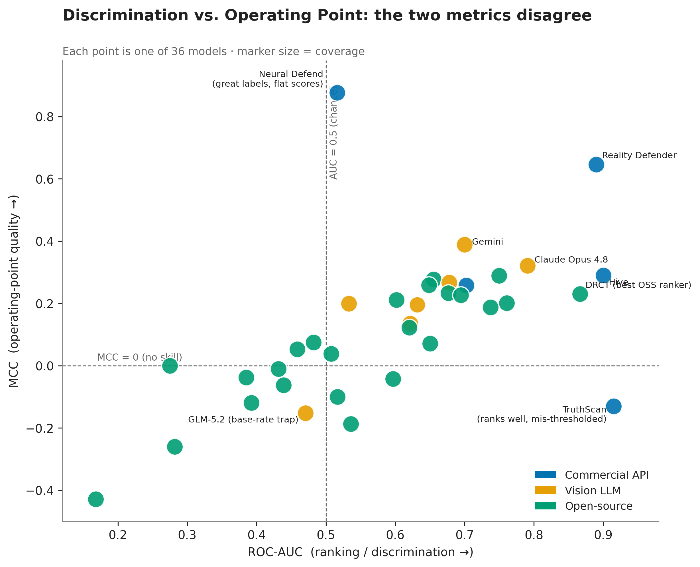

*MCC vs. ROC-AUC — the central finding: ranking power and operating-point quality diverge.*

### Leaderboard
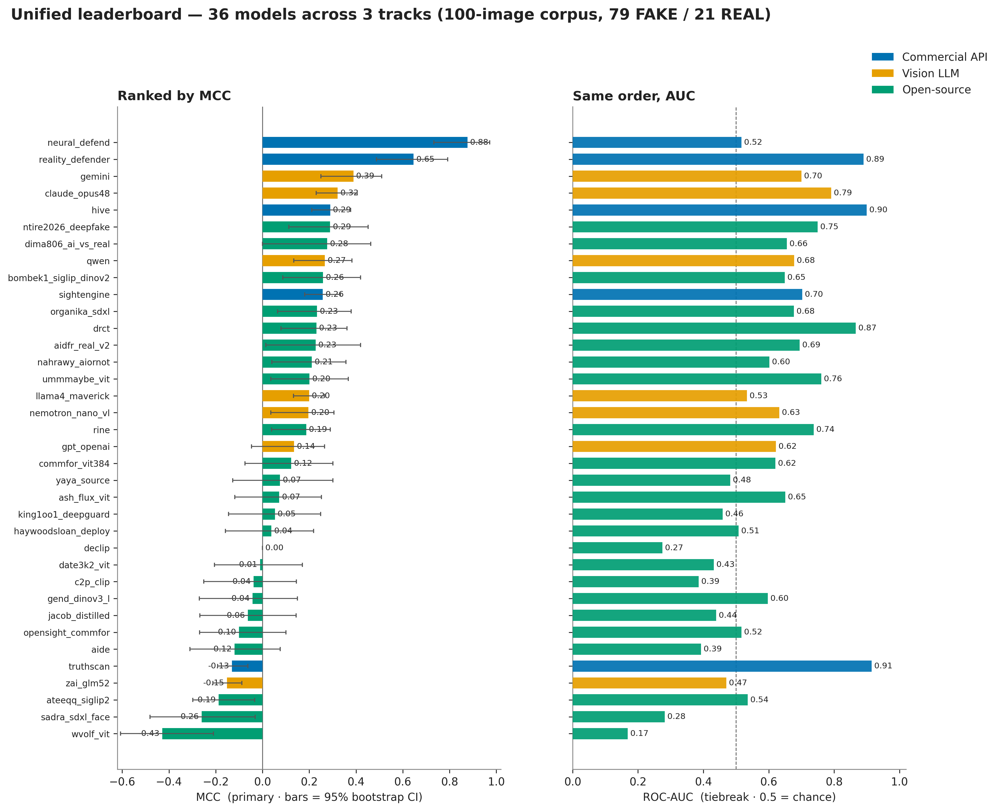

*Unified 36-model leaderboard, MCC (with 95% bootstrap CIs) and ROC-AUC.*

### Track Mcc Distribution
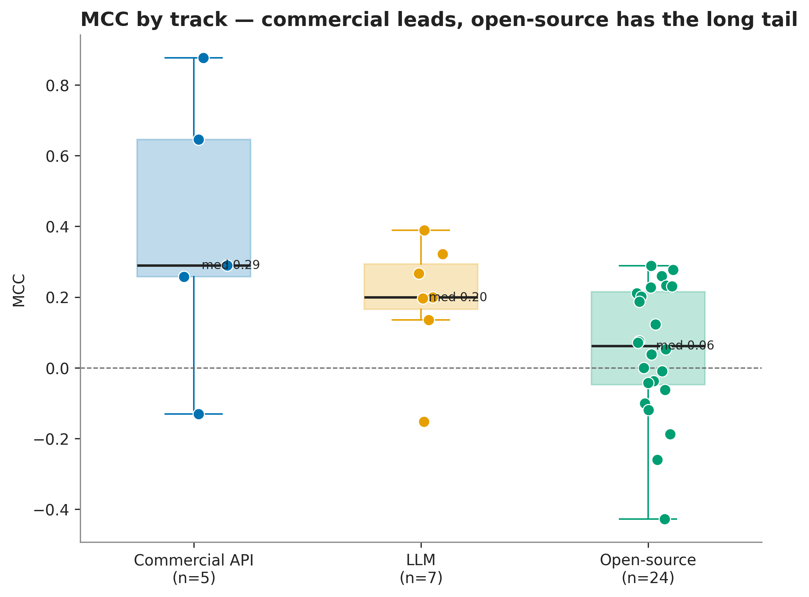

*MCC distribution by track.*

### Specificity Vs Recall
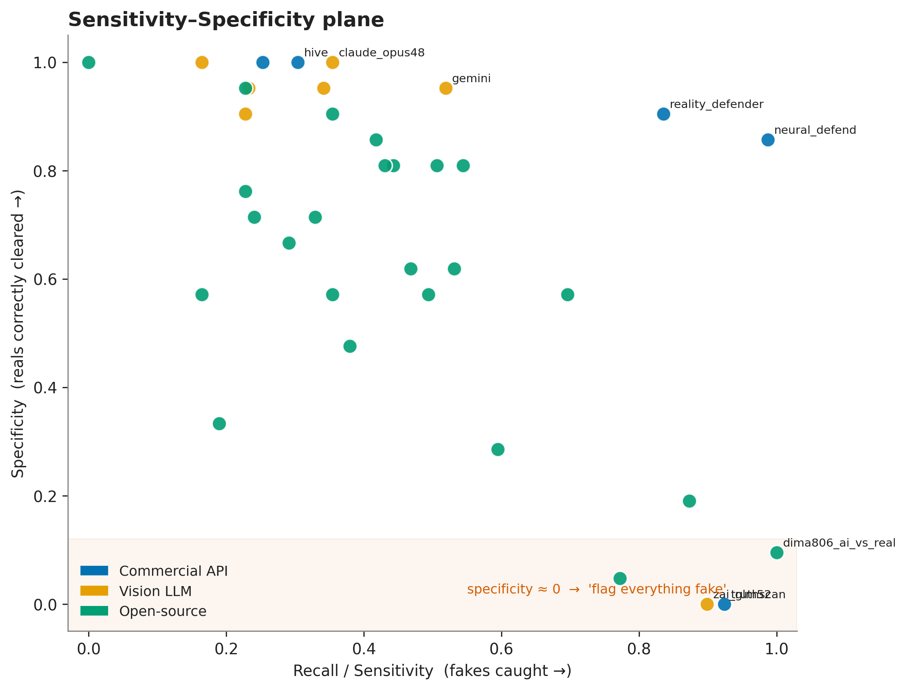

*Sensitivity–specificity plane (exposes the 'flag-everything' cluster).*

### Confusion Composition
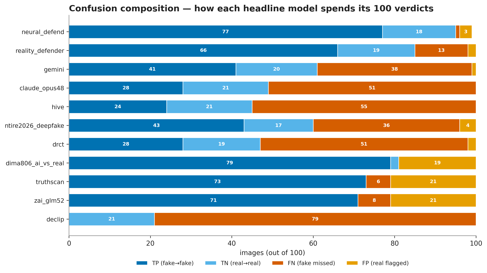

*Confusion composition for headline models (TP/TN/FN/FP of 100).*

### Latency
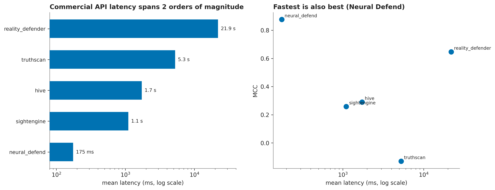

*Commercial-API latency (log scale) and latency-vs-MCC.*

### Dataset Taxonomy
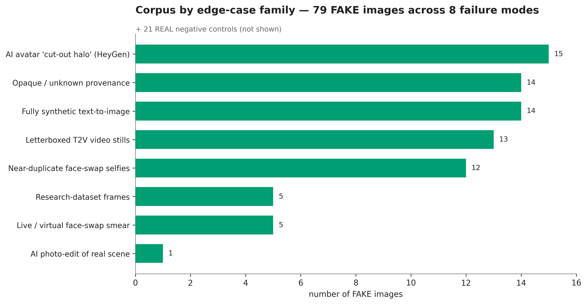

*Corpus by edge-case family (79 FAKE across 8 failure modes).*

### Format Resolution
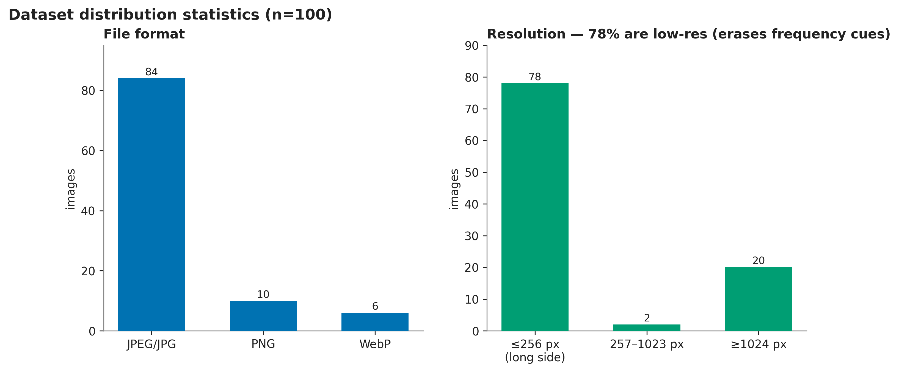

*File-format and resolution distribution.*

### Provenance
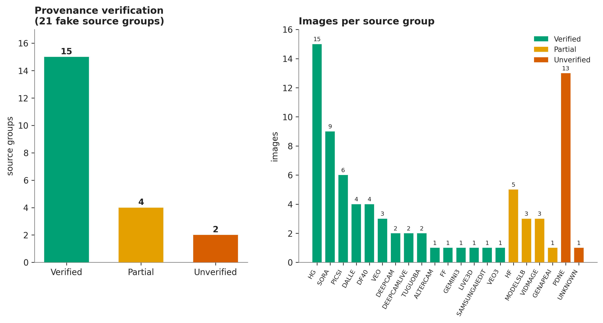

*Provenance verification (15 verified / 4 partial / 2 unverified) + per-group counts.*

### Metrics Schematic
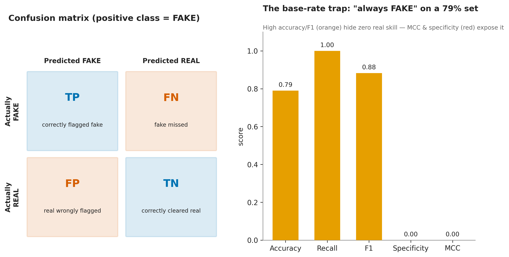

*Confusion-matrix schematic and the base-rate trap.*

### Roc Curves
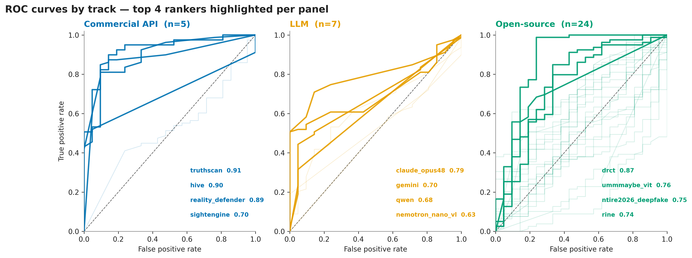

*ROC curves by track (top rankers highlighted).*

### Family Heatmap
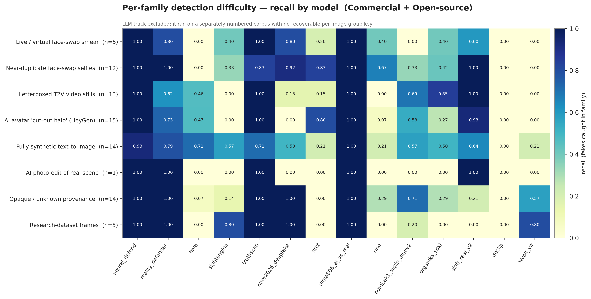

*Per-family detection recall (commercial + open-source).*

### Agreement Matrix
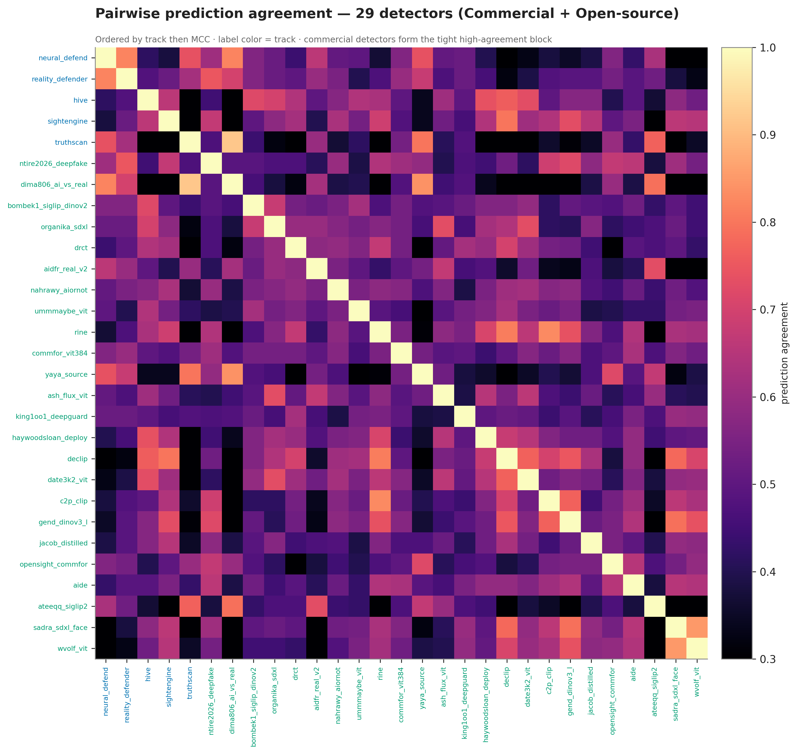

*Pairwise prediction agreement across 29 detectors.*

### Architecture
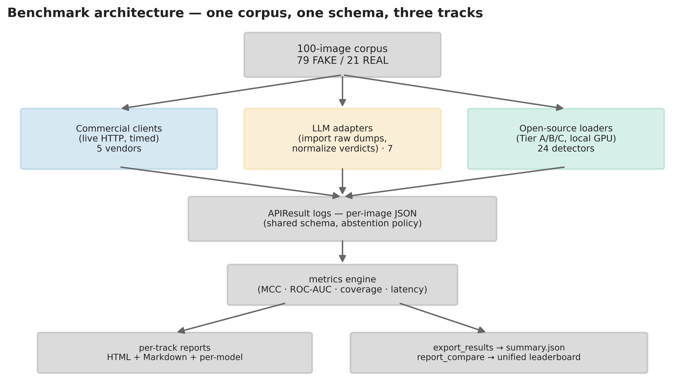

*Benchmark architecture: one corpus, one schema, three tracks.*

## Key findings

- **Best operating point (MCC):** `neural_defend` (Commercial) — MCC 0.876, Acc 0.960, F1 0.975.
- **Best ranking power (ROC-AUC):** `truthscan` (Commercial) — AUC 0.915, yet MCC −0.130 (mis-calibrated default threshold).
- **Best open-source ranker:** `drct` — AUC 0.866, ahead of every vision LLM (best LLM AUC: `claude_opus48` 0.791).
- **Paradigm ordering (median MCC):** Commercial 0.290 > LLM 0.199 > Open-source 0.062.
- **Base-rate trap:** `zai_glm52` and `truthscan` post high accuracy with specificity 0.000 and negative MCC.
